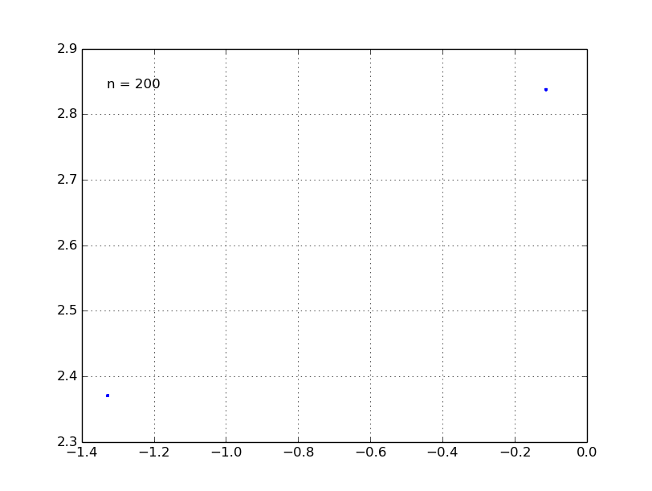

.. _6-14-label:

===============================================================================
問題6.14 - 外力を受けた減衰振り子
===============================================================================

.. contents::

シミュレーションの目的
============================

古典力学で記述される非線形力学系のよく知られた例である単振り子について、一次の減衰項があって、振り子の支点が垂直方向に動かされる場合を考えよう。この系に対するニュートンの第2法則は

.. math:: \frac{ d^{2}\theta }{ dt^{2} } = -\gamma \frac{ d\theta }{dt}-[\omega_{0}^{2} + 2A \cos \omega t]\sin \theta
    :label: e1

と書き表される。ここで\ :math:`\theta`\ は振り子が鉛直軸となす角度、\ :math:`\gamma`\ は減衰定数、\ :math:`\omega_{0}^{2}=g/L`\ は振り子の自然振動数、\ :math:`\omega`\ と\ :math:`A`\ はそれぞれ外力の振動数と振幅である。支点を垂直方向に加速することは時間に依存する重力場を考えることと等価である。
この外力を受けた減衰のある単振り子はどのように振る舞うと予想されるか。減衰項が存在するために、外力がないときには振り子は静止してしまう。つまり、(\ :math:`x=0`\ 、\ :math:`y=0`\ )は安定なアトラクタである。\ :math:`A`\ を0から大きくしていくとき、小さな\ :math:`A`\ に対してはこのアトラクタは安定である。しかし、\ :math:`A`\ がある値\ :math:`\mathrm{A}_{c}`\ を超えると、このアトラクタは不安定となる。振幅\ :math:`A`\ を大きくしていくとき、この外力を受けた非線形な振り子はどのように振る舞うだろうか。運動の(安定と不安定)固定点に主に興味があるので、外力の周期Tごとに位相空間に点をプロットして、運動の解析を行うのがよい。位相空間におけるそのような図はポアンカレ(Poincare)・プロットと呼ばれている。したがって、\ :math:`n=1,2,3\cdots`\ として、\ :math:`t=n\mathrm{T}`\ で\ :math:`d\theta/ dt`\ を\ :math:`\theta`\ に対してプロットする。系の周期がTの時にはポアンカレ・プロットは単一の点からなり、周期が\ :math:`m\mathrm{T}`\ のときには\ :math:`m`\ 個の点からなる。

作成したプログラム
=============================
Pythonを用いて作成したプログラムを以下に示す。

* パラメータの設定ダイアログ( :download:`SetParameter.py <SetParameter.py>` )

以前まで使用していたものを改良してある。show_setting_windowに渡す引数は、パラメータの名前とデフォルト値をセットにして辞書にしたもののリストと、ボタンに表示するテキストをキーとし、コマンドをその値とした辞書である。これによって更に拡張した使い方ができるようになった。

.. literalinclude:: SetParameter.py
    :language: python
    :linenos:

* 4次のルンゲクッタ法で1ステップの計算を行うプログラム( :download:`runge_kutta.py <runge_kutta.py>` )

4次のルンゲクッタ法を用いて、tの時の値yをもとにt+hのときの値を返すプログラムとなっている。引数として渡す関数と可変長の変数yを変えれば、一般に用いることのできるモジュールとなっている。

.. literalinclude:: runge_kutta.py
    :language: python
    :linenos:

* 課題aの実行プログラム( :download:`6-14_poincare_a.py <6-14_poincare_a.py>` )

課題aで用いたプログラムで、外力の周期Tごとに\ :math:`d\theta/ dt`\ を\ :math:`\theta`\ に対してプロットする。アニメーションで表示させるためにplt.ion()でpyplotのインタラクティブモードをオンにしている。しかし、そのままにすると最後のプロットが終了した時点でウィンドウが閉じてしまうので、最後のプロットでインタラクティブモードをオフにするようにした。

.. literalinclude:: 6-14_poincare_a.py
    :language: python
    :linenos:

* 課題bの実行プログラム( :download:`6-14_poincare_b.py <6-14_poincare_b.py>` )

課題bで用いたプログラムで、\ :math:`\theta`\ と\ :math:`d\theta /dt`\ を\ :math:`t`\ の関数としてプロットする。同時に表示させるためにsubplotを利用している。また、aとは異なり、すべての演算を終えてから一度に表示させるようにしてある。

.. literalinclude:: 6-14_poincare_b.py
    :language: python
    :linenos:

実習課題
=====================

a. 外力を受けた単純減衰振り子のシミュレーションを行え。プログラムでは、外力の周期Tが\ :math:`\pi`\ に等しくなるように\ :math:`\omega=2`\ 、また、\ :math:`\omega_{0}=1`\ を仮定してよい。\ :math:`\gamma=0.2`\ と\ :math:`A=0.85`\ を用いて、位相空間の軌跡を計算せよ。初期の過渡現象の後に、ポアンカレ・プロットには何個の点があるか。このことから振り子の周期はいくらか求めよ。\ :math:`\theta`\ と\ :math:`d\theta /dt`\ の初期値を変えてみよ。アトラクタは初期条件に依存しないか。初期の過渡現象を無視することを忘れないこと。
 
:math:`\gamma=0.2`\ と\ :math:`A=0.85`\ として初期値\ :math:`\theta=0.3`\ 、\ :math:`d\theta /dt=0`\ として位相空間に外力の周期Tごとに200回計算を行い、うち最後の100回をプロットした。このポアンカレ・プロットを\ :num:`図#fig-6-14-f1`\ に示す。\ :num:`図#fig-6-14-f1`\ にはプロットされている点が2つしかないため、振り子の周期は\ :math:`2\mathrm{T}=2\pi`\ であることがわかる。また、自明なことではあるが、アトラクタの位置は初期条件に依存する。ただし、振り子の周期は、運動の固定点以外であれば変わらない。固定点では周期1である。

.. _fig-6-14-f1:

    
    \ :math:`\gamma=0.2`\ 、\ :math:`A=0.85`\ としたときのポアンカレ・プロット

b. \ :math:`\theta`\ と\ :math:`d\theta /dt`\ を\ :math:`t`\ の関数としてプロットせよ。そしてポアンカレ・プロット、位相空間の図、\ :math:`\theta`\ や\ :math:`d\theta /dt`\ の\ :math:`t`\ 依存性の関係を定性的に述べよ。

:math:`\theta`\ と\ :math:`d\theta /dt`\ を\ :math:`t`\ の関数としてプロットしたものを\ :num:`図#fig-6-14-f2`\ に示す。\ :num:`図#fig-6-14-f2`\ を見ると、tの大きいところでは\ :math:`\theta`\ と\ :math:`d\theta /dt`\ はtに対して周期関数として振舞っていることがわかる。これは先程ポアンカレ・プロットより得られた理解と一致する。

.. _fig-6-14-f2:

    
    \ :math:`\theta=0.3`\ 、\ :math:`d\theta /dt = 0.0`\ 、\ :math:`\gamma=0.2`\ 、\ :math:`A=0.85`\ のときの\ :math:`t-\theta`\ 、\ :math:`t-d\theta /dt`\ のグラフ

まとめ
=======================

4次のルンゲクッタ法を用いた計算で、外力を受けた単純減衰振り子のシミュレーションを行うことができた。課題c,d,e,fにあるように、この系は外力の振幅\ :math:`A`\ をパラメータとして周期倍化の性質を見ることができる。時間の都合上取り組むことができなかったが、知識として覚えておきたいと思う。

参考文献
============================

* ハーベイ・ゴールド,ジャン・トボチニク,石川正勝・宮島佐介訳『計算物理学入門』,ピアソン・エデュケーション, 2000.

